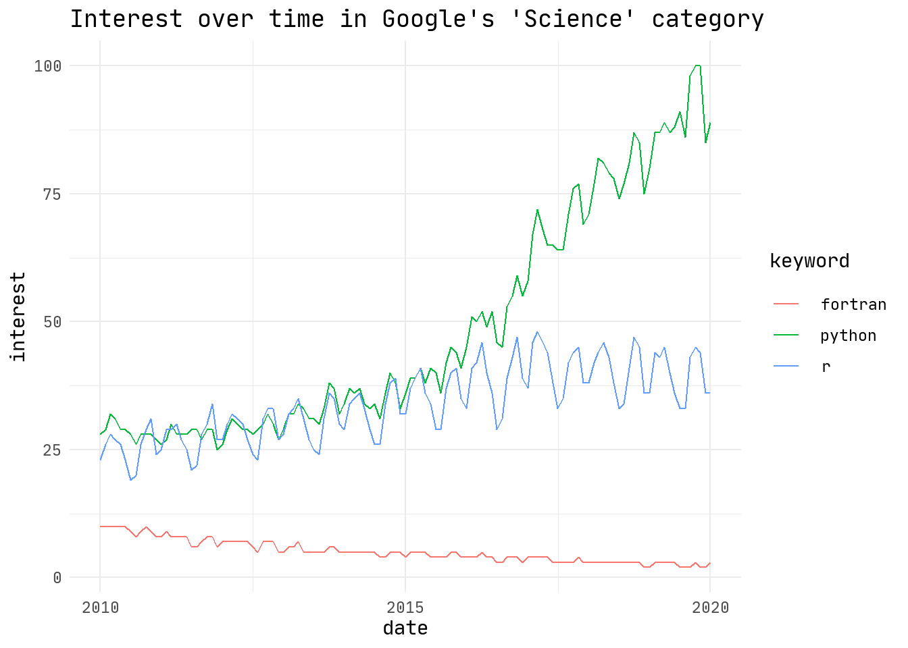

# Why Python?

That question was answered a thousand times better than me. But, here comes the highlights and my personal motivations.

## Long live the Python

Python have a giant scientific community, and so Fortran or R. What makes Python special is the other communities using it. It guarantee a long live and support to the language.

There is a list of Python uses by [Upgrad](https://www.upgrad.com/blog/python-applications-in-real-world/#2_Game_Development):

1.  Web Development
2.  Game Development
3.  **Scientific and Numeric Applications**
4.  Artificial Intelligence and Machine Learning
5.  Desktop GUI
6.  Software Development
7.  Enterprise-level/Business Applications
8.  Education programs and training courses
9.  Language Development
10. Operating Systems
11. Web Scraping Applications
12. Image Processing and Graphic Design Applications

Each one of this items has a whole community using and supporting Python. In special, AI/ML and Business brings strong economic motivations to the language support. This list also shows the "base" Python\`s flexibility.

## Python and science

Python is [open source](https://opensource.org/osd), which matches with the [open science](https://www.fosteropenscience.eu/content/what-open-science-introduction) philosophy (like this site, read more [here](https://www.americanscientist.org/blog/macroscope/the-world-of-science-blogging)).

